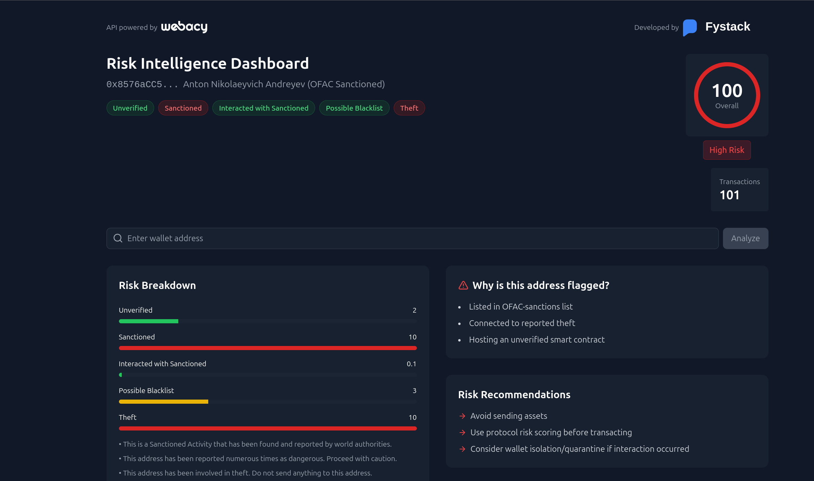

# Risk Intelligence Dashboard



A dashboard for analyzing cryptocurrency addresses for risk factors, powered by the [Webacy API](https://developers.webacy.co/).

## Features

- Analyze any Ethereum address for risk factors
- View detailed risk breakdown with severity scores
- See risk flags and recommendations
- Track fund flows and transaction history
- Overall risk score visualization

## ⚠️ Security Notice

**This application is for demonstration purposes only and is not suitable for production use.**

For production environments:

- Implement a backend proxy to protect your API key
- Never expose API keys in frontend code
- Add rate limiting and additional security measures

## Installation

1. Clone the repository

   ```bash
   git clone https://github.com/yourusername/risk-intelligence-dashboard.git
   cd risk-intelligence-dashboard
   ```

2. Install dependencies

   ```bash
   npm install
   ```

3. Create a `.env` file in the root directory and add your Webacy API key:

   ```
   VITE_WEBACY_API_KEY=your_api_key_here
   ```

4. Start the development server
   ```bash
   npm run dev
   ```

## API Key Setup

1. Sign up for an API key at [Webacy Developers](https://developers.webacy.co/)
2. Create a `.env` file in the root directory of the project
3. Add your API key:
   ```
   VITE_WEBACY_API_KEY=your_api_key_here
   ```

## Usage

1. Enter an Ethereum wallet address in the search bar
2. Click "Analyze" to retrieve risk data
3. View the overall risk score and detailed breakdown
4. Check risk flags and recommendations
5. Examine transaction history and fund flows

## Implementing a Backend Proxy (Recommended for Production)

For security reasons, you should implement a backend proxy server to handle API requests rather than exposing your API key in the frontend code.

Example implementation with Node.js and Express:

```js
const express = require('express');
const axios = require('axios');
require('dotenv').config();

const app = express();
const port = process.env.PORT || 3001;
const WEBACY_API_KEY = process.env.WEBACY_API_KEY;

// Middleware
app.use(express.json());

// Proxy endpoint
app.get('/api/address/:address', async (req, res) => {
  try {
    const { address } = req.params;
    const response = await axios.get(`https://api.webacy.com/addresses/${address}`, {
      headers: {
        'accept': 'application/json',
        'x-api-key': WEBACY_API_KEY,
      },
    });
    res.json(response.data);
  } catch (error) {
    console.error('Error fetching address data:', error.message);
    res.status(500).json({ error: 'Failed to fetch address data' });
  }
});

// Start server
app.listen(port, () => {
  console.log(`Server is running on port ${port
```

Then update the `fetchAddressData` function in your React app to use this endpoint instead.

## Tech Stack

- [Vite](https://vitejs.dev/) - Build tool and development server
- [React](https://reactjs.org/) - UI library
- [TypeScript](https://www.typescriptlang.org/) - Type safety
- [Tailwind CSS](https://tailwindcss.com/) - Styling
- [Lucide React](https://lucide.dev/) - Icons
- [Webacy API](https://developers.webacy.co/) - Risk data provider

## License

MIT

---

Developed by [Fystack](https://fystack.io) | API powered by [Webacy](https://developers.webacy.co/)
